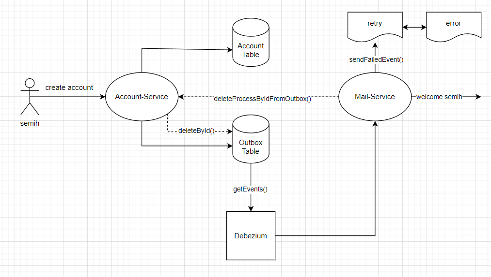
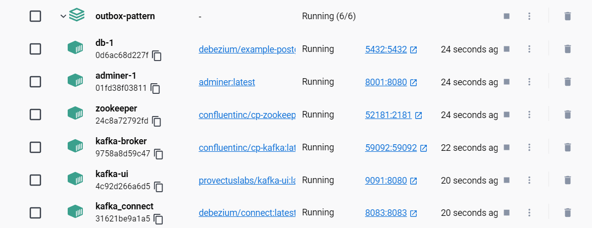

# Transactional Outbox Pattern

The Outbox Pattern is a powerful pattern used to ensure reliable event delivery in distributed systems. It decouples the process of writing to the database from the process of sending messages to other systems (e.g., through Kafka). By using an "Outbox" table, the pattern helps guarantee that events are not lost and are processed exactly once.

This repository demonstrates an implementation of the Outbox Pattern using Spring Boot, Kafka, and Debezium for Change Data Capture (CDC).

## Diagram

<p align="center">
    
</p>

## Architecture

### Components
- Account Service: Manages account-related operations and writes events to the Outbox table.
- Outbox Table: A table in the database that holds events requiring publishing to Kafka.
- Debezium: Monitors changes in the Outbox table and forwards events to Kafka topics.
- Kafka: The message broker that delivers events from the Outbox table to various services.
- Mail Service: Consumes events from Kafka and processes them to send notification emails.
- Retry and Error Handling: Mechanisms to handle failures in email sending and manage retries or log errors.

### Flow

1) Account Service: When a new user is created, it is both saved in the user table and a record is added to the Outbox table.
2) Outbox Table: After user creation, a new record is created in the Outbox table. This record contains information about the user and waits for an event to be triggered.
3) Debezium: Listens to the Outbox table. When a new record is added, it captures this event and sends it to Mail Service.
4) Mail Service: Starts the mail sending process according to the received event.
5) If Mail Sending Fails: Retry mechanism is activated. If the mail still cannot be sent after multiple attempts, the error mechanism is activated and the transaction is logged.
6) If Mail Sending Succeeds: Feedback is sent to Account Service.
7) Account Service (After Mail Sending): When the information that the mail sending was successful is received, the relevant record in the Outbox table is deleted.

## Getting Started

### Prerequisites

- **Java 17**
- **Spring Boot 3.3.3**
- **Apache Kafka**
- **Debezium**
- **PostgreSQL**
- **Docker**

### Step 1: Clone the Repository

```bash
git clone https://github.com/Semihtumay/transactional-outbox.git
cd transactional-outbox
```

### Step 2: Set Up Docker
Ensure Docker is installed and running on your system. Then, start the services:

```bash
docker-compose -f docker-compose.yml up -d
```

## To run it on Docker:

You can use the docker-compose.yml file to run it on Docker.

```dockerfile
version: '3'
services:

  kafka:
    image: confluentinc/cp-kafka:latest
    container_name: kafka-broker
    depends_on:
      - zookeeper
    ports:
      - 59092:59092
    environment:
      KAFKA_BROKER_ID: 1
      KAFKA_ZOOKEEPER_CONNECT: zookeeper:2181
      KAFKA_ADVERTISED_LISTENERS: PLAINTEXT://kafka:9092,PLAINTEXT_HOST://localhost:59092
      KAFKA_LISTENER_SECURITY_PROTOCOL_MAP: PLAINTEXT:PLAINTEXT,PLAINTEXT_HOST:PLAINTEXT
      KAFKA_INTER_BROKER_LISTENER_NAME: PLAINTEXT
      KAFKA_OFFSETS_TOPIC_REPLICATION_FACTOR: 1


  zookeeper:
    image: confluentinc/cp-zookeeper:latest
    container_name: zookeeper
    environment:
      ZOOKEEPER_CLIENT_PORT: 2181
      ZOOKEEPER_TICK_TIME: 2000
      ZK_SERVER_HEAP:
    ports:
      - 52181:2181

  kafka_connect:
    container_name: kafka_connect
    image: debezium/connect
    links:
      - db
      - kafka
    ports:
      - '8083:8083'
    environment:
      - BOOTSTRAP_SERVERS=kafka:9092
      - GROUP_ID=medium_debezium
      - CONFIG_STORAGE_TOPIC=my_connect_configs
      - OFFSET_STORAGE_TOPIC=my_connect_offsets
      - STATUS_STORAGE_TOPIC=my_connect_statuses

  kafka-ui:
    container_name: kafka-ui
    image: provectuslabs/kafka-ui:latest
    ports:
      - "9091:8080"
    restart: always
    depends_on:
      - kafka
      - zookeeper
    environment:
      - KAFKA_CLUSTERS_0_NAME=local
      - KAFKA_CLUSTERS_0_BOOTSTRAPSERVERS=kafka:9092
      - KAFKA_CLUSTERS_0_ZOOKEEPER=zookeeper:2181

  db:
    image: debezium/example-postgres
    restart: always
    environment:
      POSTGRES_USER: postgres
      POSTGRES_PASSWORD: 210821
    ports:
      - 5432:5432
    extra_hosts:
      - "host.docker.internal:host-gateway"
    command:
      - "postgres"
      - "-c"
      - "wal_level=logical"
    volumes:
      - ./init.sql:/docker-entrypoint-initdb.d/create-db-tables.sql

  adminer:
    image: adminer
    restart: always
    ports:
      - 8001:8080
```

This will start the following services:

<p align="center">
    
</p>
